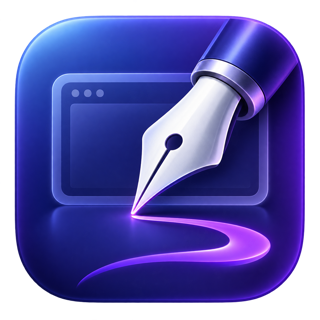
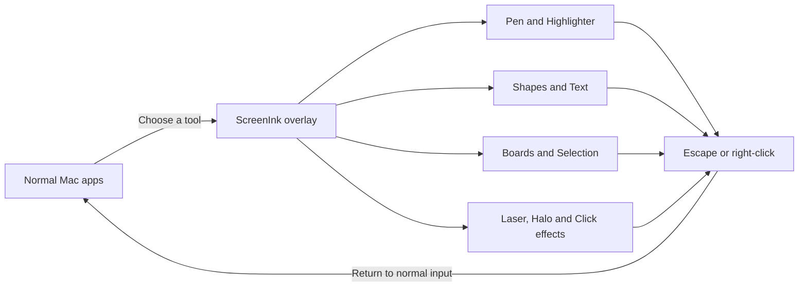

<p align="center">
  
</p>

<h1 align="center">ScreenInk</h1>

<p align="center"><strong>Draw over your Mac screen with a small, offline annotation tool.</strong></p>

<p align="center">
  <a href="docs/INSTALLATION.md">Install</a> ·
  <a href="docs/USAGE.md">Usage</a> ·
  <a href="CONTRIBUTING.md">Contribute</a> ·
  <a href="docs/RELEASING.md">Release</a> ·
  <a href="docs/PLAN.md">Roadmap</a>
</p>

ScreenInk is a native macOS menu-bar app built with Swift, AppKit and Core Graphics. Use it to mark up code, explain an idea or point out details during a presentation. The project is MIT-licensed, and contributions are welcome.

<p align="center">
  <a href="https://github.com/developerkaushalkishor/mac-tools/releases/download/v0.15.3/ScreenInk-0.15.3-macOS-arm64.zip"><strong>Download for macOS (Apple Silicon)</strong></a>
  ·
  <a href="https://github.com/developerkaushalkishor/ScreenInk-Windows/releases/download/v0.2.1/ScreenInk-0.2.1-win-x64.zip">Download for Windows (x64)</a>
</p>

> **Early preview · 0.15.3** — An unsigned Apple Silicon ZIP is available from GitHub Releases. It is not Developer ID-signed or notarized, so macOS Gatekeeper can warn or block it. Developers can build from source using the steps below. Drawing canvases are created on every connected display; see [known limitations](#known-limitations).

[Report a bug](https://github.com/developerkaushalkishor/mac-tools/issues/new/choose)

## Visual overview



The purple fountain-pen icon represents drawing directly over a screen. ScreenInk remains a menu-bar utility, so the app icon appears in Finder and Applications while the compact nib icon remains in the macOS menu bar.

## Features available now

- Pen, translucent highlighter and undoable whole-stroke eraser.
- 24-color palette, six quick colors and three widths, with saved tool settings.
- Optional fading ink, cursor halo, temporary ink visibility and configurable global drawing shortcut.
- Optional click animations that show a smooth non-blocking ripple in any app.
- Temporary laser-pointer trail for live presentation emphasis.
- Lines, arrows, rounded rectangles, ellipses and diamonds with Shift constraints, plus automatic closed-shape recognition for Pen strokes.
- Place and re-edit colored text at four sizes with six curated fonts and left, center or right alignment.
- Select, recolor, move and resize individual or marquee-selected groups of pen strokes, highlighter strokes, shapes and text with visual bounds and drag handles.
- Select a board only from its frame; moving or resizing it transforms the annotations contained inside it.
- Keep drawing gestures that begin inside a board within its writable surface; gestures started outside remain unrestricted.
- Tool-specific macOS cursors that show the active drawing action at the pointer.
- Framed whiteboard and blackboard backgrounds for one display, all displays or a dragged custom region.
- Experimental full-display and drag-region screenshots with Retina PNG save or clipboard copy; permission handling still needs a reliable hands-on fix.
- Undo, redo and clear; clearing a drawing can also be undone.
- Compact icon toolbar, initially centered below the macOS menu bar.
- Responsive More popover keeps every secondary control reachable on narrow displays; quick colors collapse automatically when space is limited.
- Drag handle with remembered position and a reset command.
- Manual hide, automatic hiding after two seconds away, and top-center hover to reveal.
- Persistent menu-bar icon for controls and quitting.
- Master disable mode that hides every overlay and prevents top-edge reveal until re-enabled from the menu bar.
- Normal mode for clicking underlying apps; drawing remains visible.
- Offline operation with no accounts, analytics, backend or third-party package dependencies.

Toolbar hiding does **not** erase ink. Fading Ink starts OFF each time the app launches.

## Quick start

You need a Mac with macOS 14 or later and a Swift 6-capable Apple toolchain. Full Xcode is recommended. The current build has been checked on Apple Silicon with macOS 26.6.2, Xcode 27 and Swift 6.4; the declared minimum OS and Intel have not been independently tested.

Install [Xcode from Apple](https://developer.apple.com/xcode/resources/), open it once, and finish its setup. Only macOS components are needed; mobile simulator downloads are optional.

```bash
git clone https://github.com/developerkaushalkishor/mac-tools.git
cd mac-tools
bash scripts/doctor.sh
bash scripts/test.sh
bash scripts/run.sh
```

The last command builds and opens `dist/ScreenInk.app`. For subsequent launches, open that app in Finder without rebuilding. No paid Apple Developer membership is needed for this local build.

See the [installation guide](docs/INSTALLATION.md) for installing to Applications, updating, alternate Xcode locations and troubleshooting. Build scripts locally ad-hoc sign the app; this is not Developer ID signing or notarization.

## Can a non-developer install it?

Yes, an Apple Silicon preview can be downloaded from the [v0.15.3 GitHub Release](https://github.com/developerkaushalkishor/mac-tools/releases/tag/v0.15.3). Extract the ZIP and move `ScreenInk.app` to Applications. The current binary is ad-hoc signed rather than Developer ID-signed and notarized, so Gatekeeper can warn or block it. Do not disable Gatekeeper globally. A trusted one-click public build still requires Apple Developer ID signing and notarization.

Windows users can download the separate [ScreenInk for Windows preview](https://github.com/developerkaushalkishor/ScreenInk-Windows/releases/tag/v0.2.1), extract the ZIP and launch `ScreenInk.exe`. The small package requires the .NET 8 Desktop Runtime; the release also provides a larger offline package with the runtime included.

The release workflow and remaining requirements are documented in [RELEASING.md](docs/RELEASING.md). The app includes its own macOS icon, but an icon alone does not provide signing or notarization.

## Basic use

1. Find the pen-and-ink icon in the macOS menu bar. Choose **Show Toolbar** if necessary.
2. Click the toolbar Pen icon to draw. Click the separate Cursor icon to return to normal app interaction.
3. Choose a quick color or open the palette for all 24 colors; click the line-weight icon to cycle widths.
4. Press **Escape** or **right-click while drawing** to return to normal clicking, or use **Toggle Drawing** in the menu.
5. Drag the dotted handle to move the toolbar. The up-chevron hides it and exits drawing mode.
6. Hover at any display's top-center edge to reveal the toolbar there, or use the menu-bar icon. The eye icon toggles auto-hide.
7. Quit using **ScreenInk menu-bar icon → Quit ScreenInk**.

Drawings are temporary and are lost when the app quits. See the [control reference](docs/USAGE.md) for details and recovery steps.

## Known limitations

- Each display has its own drawing history. Toolbar Undo/Redo/Clear affect the display containing the toolbar.
- Screenshot capture remains experimental. Screen Recording permission is required, and capture is still failing on the current test Mac after permission setup.
- Undo/redo keyboard shortcuts work while the drawing canvas has focus; they are not global shortcuts.
- Display changes do not rescale existing annotations.
- Fullscreen/Spaces behavior, screen sharing and extended drawing sessions still need hands-on testing.
- GUI launch has been observed, but the full drag/hover/click-through checklist is not yet verified. Automated tests cover history and toolbar visibility rules, not complete desktop behavior.

See [verification status](STATUS.md) and the [manual checklist](docs/TESTING.md).

## Contributing

Bug reports, reproducible compatibility findings, documentation improvements and focused pull requests are welcome. Start with [CONTRIBUTING.md](CONTRIBUTING.md). For a larger feature, discuss the scope in an issue first so work does not overlap.

```bash
bash scripts/test.sh
bash scripts/build.sh
```

Use **Xcode → File → Open → Package.swift** for native debugging, or open the repository folder in **VS Code** for editing and Git review. This is a Swift package, so no `.xcodeproj` is required. The [developer guide](docs/FIRST_MAC_APP.md) explains the code flow.

| Location | Responsibility |
| --- | --- |
| `Sources/ScreenInk` | Native windows, toolbar, menu icon and canvas |
| `Sources/InkCore` | Drawing history and toolbar visibility rules |
| `Tests/InkCoreTests` | Model regression tests |
| `scripts` | Environment selection, diagnostics, tests, build, packaging and launch |
| `Resources/Info.plist` | Application bundle metadata |

## Roadmap

Current work is release readiness: resolve screenshot permission behavior, complete fullscreen/Spaces and physical-display checks, then sign, notarize and validate a public binary on a clean Mac. Spotlight and zoom remain optional extras. See the [roadmap](docs/PLAN.md).

## License

ScreenInk's project code and documentation are available under the [MIT License](LICENSE). Apple frameworks and SF Symbols remain subject to Apple's applicable terms; the project license does not relicense those assets. ScreenInk is an independent project, not affiliated with Epic Pen or Presentify.
